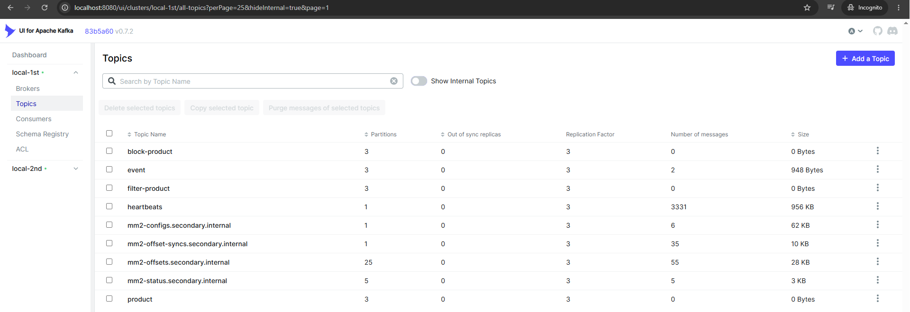
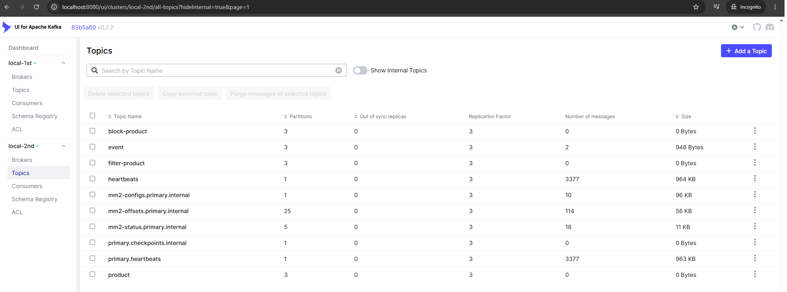
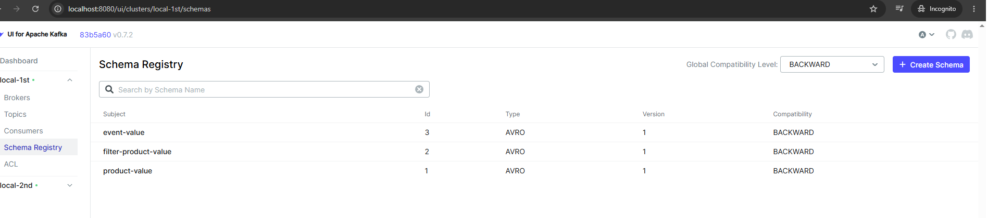
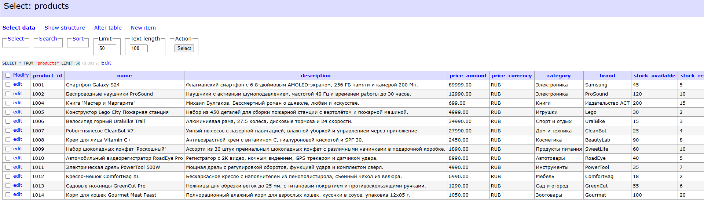
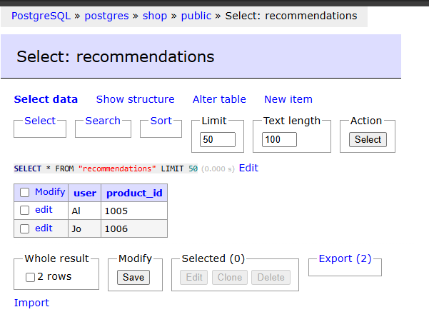
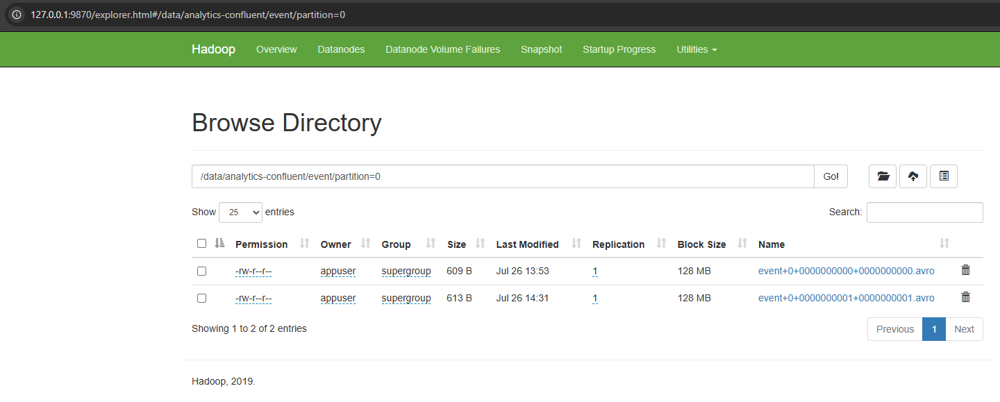

# Документация проекта

## 🧩 Архитектура и логика реализации

Проект представляет собой комплексную систему обработки событий на базе Apache Kafka, включающую два независимых кластера, защиту данных, репликацию, фильтрацию, интеграцию с хранилищами и аналитическую обработку.

### Общая схема

```
┌─────────────────────────────────────────────────────────────────────────────┐
│                      Первый кластер (local-1st)                             │
│  ┌──────────┐ ┌──────────┐ ┌──────────┐                                     │
│  │Controller│ │Controller│ │Controller│                                     │
│  │  4000    │ │  5000    │ │  6000    │                                     │
│  └────┬─────┘ └────┬─────┘ └────┬─────┘                                     │
│       │            │            │                                           │
│  ┌────┴────┐ ┌────┴────┐ ┌────┴────┐                                        │
│  │Broker   │ │Broker   │ │Broker   │                                        │
│  │1000     │ │2000     │ │3000     │                                        │
│  └─────────┘ └─────────┘ └─────────┘                                        │
│     topics: product, event, filtered-products                               │
└─────────────────────────────────────────────────────────────────────────────┘
                                    │
                          MirrorMaker 2 (репликация)
                                    │
┌─────────────────────────────────────────────────────────────────────────────┐
│                      Второй кластер (local-2nd)                             │
│  ┌──────────┐ ┌──────────┐ ┌──────────┐                                     │
│  │Controller│ │Controller│ │Controller│                                     │
│  │  4001    │ │  5001    │ │  6001    │                                     │
│  └────┬─────┘ └────┬─────┘ └────┬─────┘                                     │
│       │            │            │                                           │
│  ┌────┴────┐ ┌────┴────┐ ┌────┴────┐                                        │
│  │Broker   │ │Broker   │ │Broker   │                                        │
│  │1001     │ │2001     │ │3001     │                                        │
│  └─────────┘ └─────────┘ └─────────┘                                        │
│     topics: product, event, filtered-products (реплицируется)               │
└─────────────────────────────────────────────────────────────────────────────┘
```

### Компоненты системы

| Компонент                     | Назначение                                                                                |
| ----------------------------- | ----------------------------------------------------------------------------------------- |
| **Kafka (2 кластера)**        | Центральная шина данных, каждый кластер состоит из 3 брокеров и 3 контроллеров (KRaft).   |
| **Schema Registry**           | Хранение Avro-схем для сериализации (по одному на кластер).                               |
| **MirrorMaker 2**             | Репликация топиков из первого кластера во второй.                                         |
| **Shop**                      | Продюсер в топики `product`                                                               |
| **Client**                    | Потребитель, читающий рекомендации из топика `recommendations`. Продюсер в топики `event` |
| **Kafka Connect (JDBC)**      | Запись данных о продуктах в PostgreSQL (Sink-коннектор).                                  |
| **Kafka Connect (HDFS)**      | Запись событий в HDFS (Avro-формат).                                                      |
| **PostgreSQL**                | Хранилище для продуктовой витрины.                                                        |
| **HDFS (NameNode+DataNode)**  | Распределённое хранилище для аналитических данных.                                        |
| **Spark (Master+Worker)**     | Аналитическая обработка данных из HDFS с записью рекомендаций обратно в Kafka.            |
| **Prometheus + Alertmanager** | Сбор метрик и отправка алертов.                                                           |
| **Grafana**                   | Визуализация метрик (дашборды).                                                           |

### Защита и управление доступом

- **TLS** (SSL) – все соединения зашифрованы (SASL_SSL).
- **SASL/PLAIN** – аутентификация пользователей (`admin`, `producer`, `consumer`, `kafkaconnect`, `hdfs`).
- **ACL** – ограничения на операции:
  - Пользователь `producer` имеет права `WRITE` и `DESCRIBE` на топик `product`.
  - Пользователь `consumer` имеет права `WRITE` на топик `event`.

### Обработка данных

1. **Генерация событий** – сервис `shop` отправляет сообщения в топик:
   - `product` – информация о товарах (JSON).

1. **Фильтрация запрещенных товаров** – отдельный стриминговый процесс (Kafka Streams) читает топик `product`, фильтрует записи по условиям (например, `is_blocked = false`) и записывает в топик `filtered-products`. (Этот компонент не входит в docker-compose, но логика реализована в отдельном микросервисе.)

2. **Запись в PostgreSQL** – коннектор JDBC Sink читает топик `filtered-products` и вставляет данные в таблицу `products` в PostgreSQL.

3. **Репликация во второй кластер** – MirrorMaker 2 дублирует топик `event` из первого кластера во второй, обеспечивая отказоустойчивость и разделение аналитической нагрузки.

4. **Запись в HDFS** – коннектор HDFS Sink читает топик `event` из второго кластера и сохраняет данные в Avro-файлы в HDFS.

5. **Аналитическая обработка** – Spark-приложение читает данные из HDFS, производит вычисления (например, подсчёт популярных товаров) и записывает рекомендации в топик `recommendations` первого кластера.

6. **Потребление рекомендаций** – сервис `client` читает топик `recommendations` и отображает их пользователю.  Отправляет сообщения в топик `event` – события пользователей (Avro).

### Мониторинг

- **Prometheus** собирает метрики с Kafka Exporters (по одному на кластер) и JMX-метрики брокеров.
- **Alertmanager** настроен на отправку оповещений при падении брокеров, задержках, ошибках коннекторов.
- **Grafana** предоставляет дашборды с графиками:
  - Пропускная способность топиков (in/out)
  - Lag потребителей
  - Загрузка брокеров
  - Состояние коннекторов
  - Доступность кластеров

---

## 🛠 Использованные технологии

- **Apache Kafka** (Confluent Platform 7.4.4) – брокеры, контроллеры (KRaft), MirrorMaker 2.
- **Schema Registry** – управление схемами Avro.
- **Kafka Connect** – интеграция с PostgreSQL (JDBC) и HDFS.
- **PostgreSQL 16** – реляционная база данных.
- **HDFS** (Hadoop 3.2.1) – распределённое файловое хранилище.
- **Apache Spark 3.5.3** – аналитическая обработка.
- **Docker Compose** – оркестрация контейнеров.
- **Prometheus + Alertmanager + Grafana** – мониторинг и алертинг.
- **Python** – скрипты для регистрации коннекторов и инициализации данных.
- **OpenSSL** – генерация TLS-сертификатов.

---

## 🚀 Инструкция по запуску

### Предварительные требования

- **Docker** (20.10+) и **Docker Compose** (2.0+)
- **Git** (для клонирования репозитория)
- Минимум **8 ГБ RAM** и **4 ядра CPU** (рекомендуется 16 ГБ).

### Шаги для запуска

1. **Создайте TLS-сертификаты** (если они отсутствуют). В корне проекта находится директория `ca/` с готовыми сертификатами. Если нужно сгенерировать новые, выполните скрипт:
   ```bash
   ./scripts/generate-certs.sh
   ```

2. **Настройте переменные окружения** (опционально). Пароли и пользователи заданы в `docker-compose.yaml` и `kafka_server_jaas.conf`. При необходимости измените их.

3. **Запустите все сервисы:**
   ```bash
   docker compose build && docker compose up -d
   ```
   Это поднимет оба кластера Kafka, Schema Registry, MirrorMaker, коннекторы, PostgreSQL, HDFS, Spark, мониторинг и вспомогательные сервисы.

4. **Проверьте, что все контейнеры работают:**
   ```bash
   docker compose ps
   ```

5. **Создайте топики:** выполните скрипт
   ```bash
   ./scripts/add_topics.sh
   ```

6. **Настройте ACL:** выполните скрипт для добавления прав пользователям:
   ```bash
   ./scripts/add_ACL.sh
   ```
   Скрипт добавит правила для топиков `product` и `event` в первом кластере.
7. **Зарегестрируйте Схемы**
   ```
   docker exec -it schema-registry-1st ./register-schema.sh
   docker exec -it schema-registry-2nd ./register-schema.sh
   ```

8. **Зарегистрируйте коннекторы**:
   - JDBC Sink (PostgreSQL):
     ```bash
     docker exec -it final-kafka-connect-1 /scripts/connect-sink-register.sh
     ```
   - HDFS Sink:
     ```bash
     docker exec -it final-kafka-connect-hdfs-1 /scripts/hdfs-sink-register.sh
     ```

8. **Загрузите начальные данные** :
   ```bash
   docker exec -it final-shop-1 producer 
   ```
Фильтруе товары используя goka
   ```
 docker exec -it final-shop-1 filter
   ```

9. **Блокировку товаров можно проверить** 
   ```
   docker exec -it final-shop-1 block -product ТВ -cmd add
   docker exec -it final-shop-1 block -product ТВ -cmd rm
   ```
10. **Проверить клиентское апи**
    ```
    docker exec -it final-client-1 search -user Jo -product конструктор
    docker exec -it final-client-1 recom -user Jo
    ```

11. **Запустите аналитический Spark-джоб** 
   ```
   scripts\spark-hdfs-to-postgres.sh
   ```

12. **Откройте Grafana** для просмотра дашбордов:
    - URL: `http://localhost:3000`
    - Логин: `admin`, пароль: `admin` (изменён в первом запуске).

13. **Проверьте работу** через Kafka UI:
    - URL: `http://localhost:8080`
    - Убедитесь, что топики заполняются данными, а коннекторы активны.


---

## 📎 Дополнительные материалы

- `docker-compose.yaml` – основной манифест оркестрации.
- `kafka_server_jaas.conf` – конфигурация SASL/PLAIN.
- `scripts/` – скрипты для регистрации коннекторов, добавления ACL, генерации сертификатов.
- `monitoring/` – конфигурации Prometheus, Alertmanager, дашборды Grafana.
- `hdfs/` – конфиги Hadoop.
- `spark/` – приложения для аналитики.


## Скриншоты

Kafka UI — топики cluster-1: 



Kafka UI — топики cluster-2 репликация: 



Kafka UI — Schema Registry: 



Adminer — таблица `products` после JDBC sink:



Adminer — таблица `recommendations` после Spark:



Hadoop:


